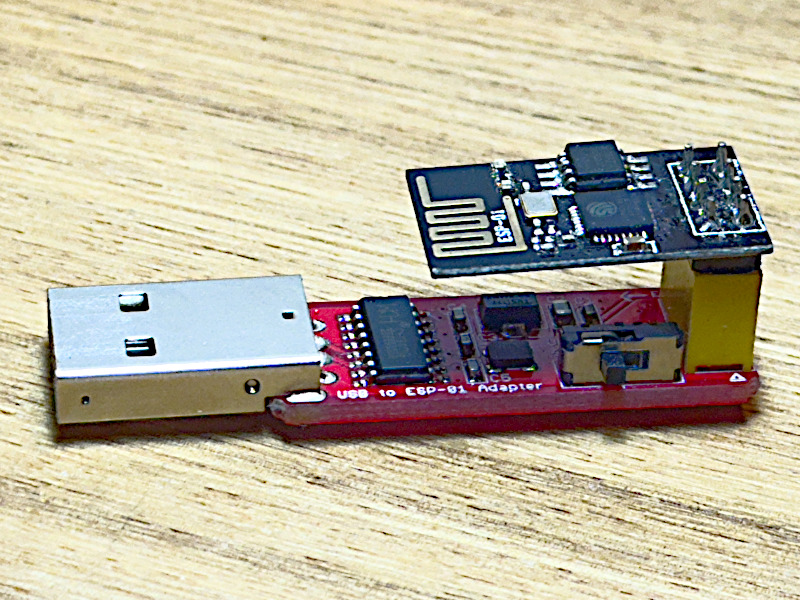

# flash-at-firmware-to-esp-01
Flash a modern version of AT-firmware to a legacy 1-MB ESP-01 module

This article rediscovers a method I have used to install the AT-command firmware onto an old-model ESP-01 module having just 1 MB of flash.

An ESP-01 module needs to connect through some sort of go-between device for programming. The photo shows one mounted on a USB adapter for direct connection to a computer. 

A switch on the adapter can place the ESP-01 into "Program mode" or "UART Mode". The latter mode enables Serial communication between a computer and a program running on the ESP-01. This capability can aid debugging during program development.

The AT-commands transform the ESP-01 into an interactive appliance without having to write a program for its built-in ESP8266 processor. I use the module's WiFi capability to enable internet access for projects running on Arduino Unos and Nanos, and on bare AVR microcontrollers.

It may be that Espressif, the manufacturer, supplies an 'official' software for the purpose. Because I live in Linux-land, including Mac OS, I needed another way to do it.

One answer is to use other tools and software that Espressif also provides: the esptool.py program and a reasonably up-to-date set of binary files for the firmware.

Tutorial abound online for doing this. Some are obsolete, many were difficult for me to follow. I wanted to use contemporary resources from the official manufacturer.

I will explain where I found what I needed first. After that I will show I used them.

## Resource Locations

The easiest way for me to install the esptool software was to add the ESP8266 board package to my Arduino IDE.

Follow the instructions for *Installing With Boards Manager* on the GitHub page for the 8266 Boards package for Arduino: [https://github.com/esp8266/Arduino](https://github.com/esp8266/Arduino).

Arduino IDE can upload programs onto an ESP-01 connected by a programmer such as the one pictured above. Its Serial Monitor can communicate with the ESP-01 that way, also.

The esptool software comes included with the ESP8266 package. Later in this article it will reveal its own location as a side effect of uploading a short program to the ESP-01. 

A reasonably current set of files for the AT-command firmware was available in late October, 2025, in a repository that Espressif maintains on Github: [https://github.com/espressif/ESP8266_NONOS_SDK](https://github.com/espressif/ESP8266_NONOS_SDK). 

Navigate into the 'bin' folder where you will see a list of files having names that end with '.bin'. There also is a folder named 'at'. 

Peek inside the 'at' folder. Notice the README.md file along with a subfolder named '512-512'. Look inside that subfolder for two files having names that begin with 'user'. 

If you see all of these files, you have arrived at a good place. You want to download this repository.

Navigate back to the top level, *ESP8266_NONOS_SDK*, click the CODE button and select the option to download a .zip file. 

Unzip this file on your computer, then locate the resulting folder. It will have the same name. Navigate into that folder, where you will see the files from the GitHub repository duplicated on your own computer.

Here is the file list in the 'bin' folder. The first two files are sub-folders. The rest are binary files, bearing dates in June, 2024 the last time I downloaded them. Some of the binary files are to be uploaded to the ESP-01.

<pre>
at
at_sdio
blank.bin
boot_v1.2.bin
boot_v1.6.bin
boot_v1.7.bin
esp_init_data_default_v05.bin
esp_init_data_default_v08.bin
</pre>

The README.md file inside the 'at' folder, inside the 'bin' folder, reveals information needed during the actual flashing procedure. It identifies whichy files to upload, and importantly, the correct addresses for where to store them in the ESP-01 memory.

<pre>
# BOOT MODE
## download

### Flash size 8Mbit: 512KB+512KB
    boot_v1.2+.bin              0x00000
    user1.1024.new.2.bin        0x01000
    esp_init_data_default.bin   0xfc000
    blank.bin                   0x7e000 & 0xfe000
</pre>

## Prepare the ESP-01

I like to begin by making the ESP-01 be quiet when I attach the USB adapter to the computer. 

The way I achieve this is to upload a very short program from the Arduino IDE. Here is the listing:

~~~ c
1 void setup () {}
2 void loop () {}
3 int main () { return 0; }
~~~

This program will end immediately after it begins, leaving the ESP-01 docile and receptive.

This article is not finished. I just have to go to bed. I will return soon to finish it.

If Arduino IDE complains that it cannot find 'python', and you are running on a modern Linux distribution such as Ubuntu, you might need to install a short utility package to make your python3 respond to the plain name, 'python'. Here is a link that explains this utility, named [python-is-python3](https://ubuntu.pkgs.org/25.04/ubuntu-main-amd64/python-is-python3_3.13.3-1_all.deb.html).

